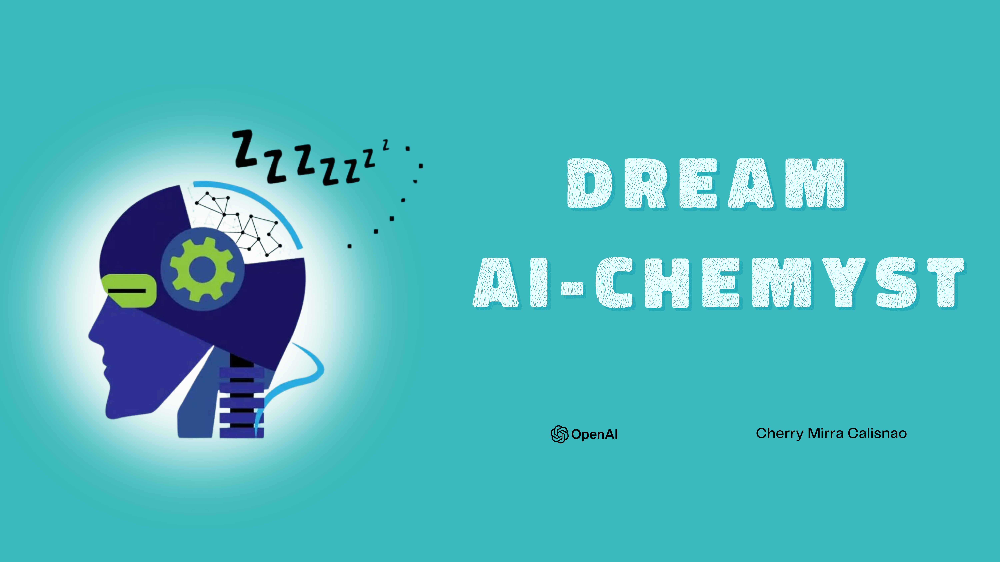

# Dream AI-Chemyst 🌌

An AI-driven dream interpreter designed to help users explore the meanings and symbolism behind their dreams, offering insights and explanations based on psychological principles and cultural references.

## Functional Features 🛠️

### A. User Input Forms:
- **Dream Description:** Users describe the details of their dream.
- **Current Life Circumstances:** Users provide information about their current feelings, thoughts, and circumstances that may relate to their dream.
- **Dream Genre Selection:** Users select the genre of their dream from options like Adventure, Nightmare, Fantasy, etc.

### B. AI Interpretation:
- **Dream Analysis:** The app uses OpenAI's GPT-3.5-turbo model to generate interpretations based on the user's inputs.
- **Symbolism and Psychology:** It offers insights into the symbolism and psychological aspects of the dream, linking them to the user’s real-life context.

### C. Progress Feedback:
- **Progress Bar:** While generating the interpretation, a progress bar keeps users informed about the processing status.

### D. Display and Interaction:
- **Formatted Output:** The app displays the dream description, life circumstances, selected genre, and the AI-generated interpretation in a formatted manner.

## Demo 🎥
 [Dream AI-Chemyst App](https://drive.google.com/file/d/1-NuPxGMal0G9Sy3_HhLFvHhJUYxQkEVl/view?usp=sharing)
 

## Streamlit App Link 🔗
 [Dream AI-Chemyst App](https://dreamapp-calisnao-cs3a.streamlit.app/)

## Submitted by:
**CALISNAO, CHERRY MIRRA   BSCS 3A**
